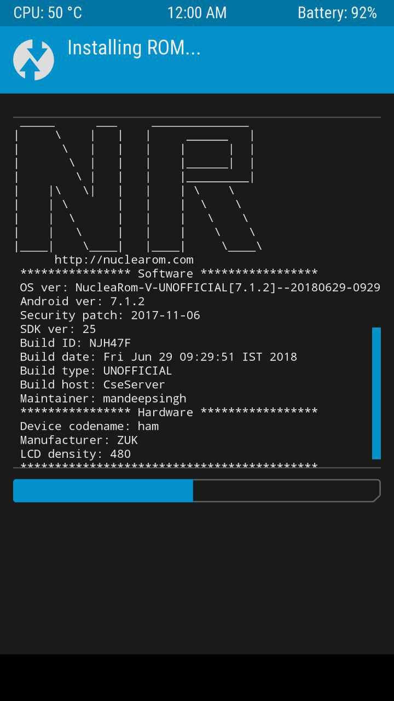
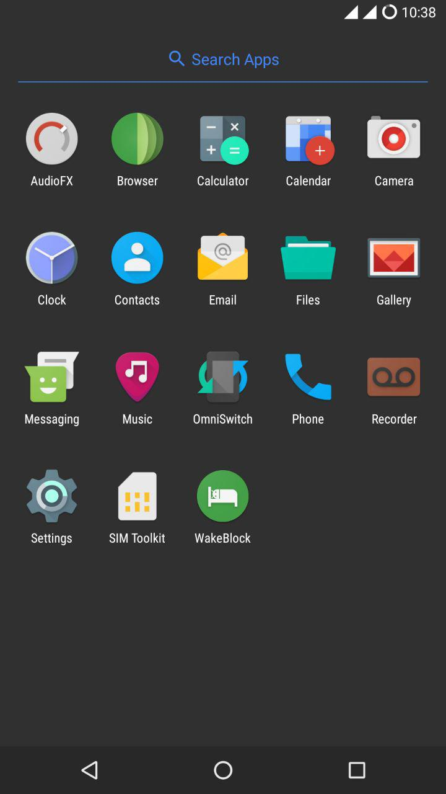
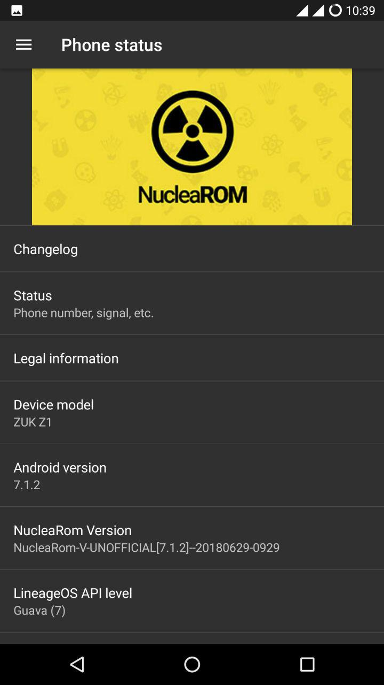

% Compiling Custom ROMS
% Mandeep Singh
% June 30, 2018

# Android ROMs

Convert this markdown to slides using:
$ pandoc -t revealjs -i --slide-level=2 -s rom.md -o rom.html

# Stock ROM

## Pros

- Warranty
- You tell?

## Cons

- Bloated
- Slow Performance
- Slow to 0 updates
- Bugs

# Custom ROM

## Pros

- Highly Customizable
- Control
- Performance
- Battery Life
- Bleeding Edge
- and a lot more Craziness!

## Cons

- Warranty void
- Security issues
- Dangerous

With Great *Power* comes Great *Responsibility*


# How to Install

## Things you need
- Unlocked Bootloader
- Custom Recovery
- ROM zip file
- GApps
- Demo?

# Compiling the ROM

## Lineage OS


<https://github.com/LineageOS/android>

## Requirements

- Minimum 8 GB RAM
- 100 GB Disk Space
- A lot of **patience**


## Steps to build the ROM

- Install dependencies
- repo tool
- repo init

    ```bash
    $ repo init -u git://github.com/LineageOS/android.git -b cm-14.1
    ```
- repo sync

    ```bash
    $ repo sync
    ```

-------

- 30-40 GB of Downloading...


- Environment setup

    ```bash
    $ source build/envsetup.sh
    ```

- breakfast `<device code>`

    ```bash
    $ breakfast ham
    ```
- brunch `<device code>`

    ```bash
    $ brunch ham
    ```

# Errors

----

{ width=40% }

----

{ width=40% }

----

{ width=40% }

----

{ width=40% }

----

{ width=40% }
